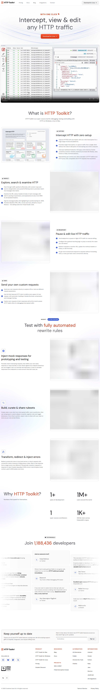

# Visited: https://httptoolkit.com/
**Time:** Sun May  3 18:47:06 UTC 2026

## Screenshot

## Raw HTML
[page.html](./page.html)

## Downloaded Media (8 files)
## Downloaded Media Files

- [play_480p.mp4](./media/play_480p.mp4) (5405 KB)
- [play_720p.mp4](./media/play_720p.mp4) (9640 KB)
- [1777834021_play_480p.mp4](./media/1777834021_play_480p.mp4) (1988 KB)
- [1777834022_play_720p.mp4](./media/1777834022_play_720p.mp4) (3566 KB)
- [1777834023_play_480p.mp4](./media/1777834023_play_480p.mp4) (2326 KB)
- [1777834024_play_720p.mp4](./media/1777834024_play_720p.mp4) (4174 KB)
- [1777834025_play_480p.mp4](./media/1777834025_play_480p.mp4) (5358 KB)
- [1777834025_play_720p.mp4](./media/1777834025_play_720p.mp4) (9437 KB)

## Other Links
- [#main-content](#main-content)
- [/](/)
- [/_next/static/chunks/2117-fc5810a9a75c1b75.js](/_next/static/chunks/2117-fc5810a9a75c1b75.js)
- [/_next/static/chunks/2143-c60ea8105a6866f4.js](/_next/static/chunks/2143-c60ea8105a6866f4.js)
- [/_next/static/chunks/2592-dc899d5d5d45fcf2.js](/_next/static/chunks/2592-dc899d5d5d45fcf2.js)
- [/_next/static/chunks/2953-60013b327cfaded6.js](/_next/static/chunks/2953-60013b327cfaded6.js)
- [/_next/static/chunks/3647-c25eb9dbbb1935ab.js](/_next/static/chunks/3647-c25eb9dbbb1935ab.js)
- [/_next/static/chunks/3664-709df4037b1a7c73.js](/_next/static/chunks/3664-709df4037b1a7c73.js)
- [/_next/static/chunks/4540-96692544f923c29d.js](/_next/static/chunks/4540-96692544f923c29d.js)
- [/_next/static/chunks/5763-4ba75673398f9a57.js](/_next/static/chunks/5763-4ba75673398f9a57.js)
- [/_next/static/chunks/622-bae1d3d74ebe718f.js](/_next/static/chunks/622-bae1d3d74ebe718f.js)
- [/_next/static/chunks/6439-d9f3434771f58cf2.js](/_next/static/chunks/6439-d9f3434771f58cf2.js)
- [/_next/static/chunks/8746-58d46ffc882de25c.js](/_next/static/chunks/8746-58d46ffc882de25c.js)
- [/_next/static/chunks/9305-882beb79758d540a.js](/_next/static/chunks/9305-882beb79758d540a.js)
- [/_next/static/chunks/app/(alternatives)/layout-c6fd4e6edc4a3bcb.js](/_next/static/chunks/app/(alternatives)/layout-c6fd4e6edc4a3bcb.js)
- [/_next/static/chunks/app/layout-86989465b5a39096.js](/_next/static/chunks/app/layout-86989465b5a39096.js)
- [/_next/static/chunks/fd9d1056-d2c174ee935f8b71.js](/_next/static/chunks/fd9d1056-d2c174ee935f8b71.js)
- [/_next/static/chunks/main-app-c63dc4ea3f6aa9e2.js](/_next/static/chunks/main-app-c63dc4ea3f6aa9e2.js)
- [/_next/static/chunks/polyfills-42372ed130431b0a.js](/_next/static/chunks/polyfills-42372ed130431b0a.js)
- [/_next/static/chunks/webpack-9794ed0ce0fcd97a.js](/_next/static/chunks/webpack-9794ed0ce0fcd97a.js)
- [/_next/static/css/006b1064c740e4f0.css](/_next/static/css/006b1064c740e4f0.css)
- [/_next/static/css/0ee2c402c1083a43.css](/_next/static/css/0ee2c402c1083a43.css)
- [/_next/static/css/168f96f9c46f4e2e.css](/_next/static/css/168f96f9c46f4e2e.css)
- [/_next/static/css/2073e156b285e775.css](/_next/static/css/2073e156b285e775.css)
- [/_next/static/css/458116a2a642c71e.css](/_next/static/css/458116a2a642c71e.css)
- [/_next/static/css/49076f7780c63208.css](/_next/static/css/49076f7780c63208.css)
- [/_next/static/css/49f527c81684fca3.css](/_next/static/css/49f527c81684fca3.css)
- [/_next/static/css/4daaf7edfccaa043.css](/_next/static/css/4daaf7edfccaa043.css)
- [/_next/static/css/5220c5ec4b3ed65c.css](/_next/static/css/5220c5ec4b3ed65c.css)
- [/_next/static/css/5403ca2b02b7b01e.css](/_next/static/css/5403ca2b02b7b01e.css)
- [/_next/static/css/5de7c04d7e6400be.css](/_next/static/css/5de7c04d7e6400be.css)
- [/_next/static/css/64961f7647be3a4b.css](/_next/static/css/64961f7647be3a4b.css)
- [/_next/static/css/75ea1f8488073e3a.css](/_next/static/css/75ea1f8488073e3a.css)
- [/_next/static/css/7649cdee1d911eff.css](/_next/static/css/7649cdee1d911eff.css)
- [/_next/static/css/769fcb82d7f170f1.css](/_next/static/css/769fcb82d7f170f1.css)
- [/_next/static/css/8713fe35aa1263e5.css](/_next/static/css/8713fe35aa1263e5.css)
- [/_next/static/css/891a56d48d185f9b.css](/_next/static/css/891a56d48d185f9b.css)
- [/_next/static/css/a1f68b720bcd3750.css](/_next/static/css/a1f68b720bcd3750.css)
- [/_next/static/css/aa3903eb6251f6a3.css](/_next/static/css/aa3903eb6251f6a3.css)
- [/_next/static/css/ae04ec549b2da32f.css](/_next/static/css/ae04ec549b2da32f.css)
- [/_next/static/css/b509f1b56c99439b.css](/_next/static/css/b509f1b56c99439b.css)
- [/_next/static/css/d0191bc41b1bad60.css](/_next/static/css/d0191bc41b1bad60.css)
- [/_next/static/css/e38fbdf7d4108bd3.css](/_next/static/css/e38fbdf7d4108bd3.css)
- [/_next/static/css/eb4d18182fb43c5d.css](/_next/static/css/eb4d18182fb43c5d.css)
- [/_next/static/css/f92a17f462fa6582.css](/_next/static/css/f92a17f462fa6582.css)
- [/_next/static/media/13971731025ec697-s.p.woff2](/_next/static/media/13971731025ec697-s.p.woff2)
- [/all-integrations/](/all-integrations/)
- [/alternatives/](/alternatives/)
- [/android/](/android/)
- [/blog/](/blog/)

## Stats
- Links: 120
- Media: 8
